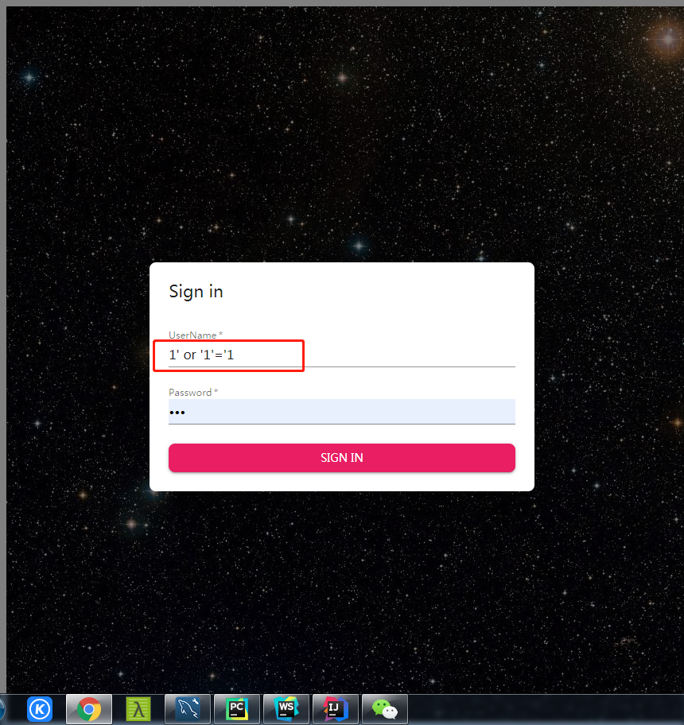

# JBook

---

### author : JY

### version : v3.0

---

## Technology introduction

---

### Frontend

* React
* Redux
* Material-ui

### Backend

* Spring boot
* Servlet
* Hiberate
* Spring Security

### Connect front and back

* axios

### Database

* Mysql
* MongoDB

## Function description

---

- [x] visit, sign in, sign up
- [x] add to cart, buy directly
- [x] empty the shopping cart, search order
- [x] add,delete, update,search book
- [x] look the history buying statistics
- [x] comment on books
- [x] add tag to book and classification

## Something interesting during devlopment

---

#### Sql injection my web

1. I input the username with 1' or '1'='1 maliciously. And password I try 123

2. Then I got the sql statement at my backend as below:

3. And then I sign in my website successfully as someone whose password is 123

4. But then I found that it's accidental because the one whose id is 1 and his password is exactly 123, if not, I couldn't sign in. What I mean is that this injection only suits the case that I know the password of the one whose id must be  1, but don't know his username, then I can login as him. It's rediculous. How can I know one's password but don't know his username?

5. So I try again, and find the right usage of sql injection :
   username: 1' or password = '123

   password: 123
   then the sql statement at the backend will be:
   select ... from user where username = '1' or password = '123'

hints: I had fix this bug by using hibernate, so you can no longer enjoy it.

---

### Something fucking during development

* Naming conflict
  * the table name can not be 'order'
  * the variable name of react can not be 'key'
  * the column name of the database should obey the normal rule: 'is_manager' but not 'isManager'

* Deploy matters
  * port mapping in docker
    * open the security group in aliyun
    * docker run ... -p 8888:8080, here 8888 is the port open in aliyun and if you want to visit it you should add ip_address:8888 and 8080 is the port of your app(set in application.properties)

* withCredentials and cookie

  * 现象

    * 有的请求发送两次（复杂请求，第一次为OPTIONS，第二次才是真正的），第一次withCredentials 为true，第二次为false：showBooks(getWith), updateBook(put), addABook(post)...
    * 有的请求发送一次，withCredentials为true：showUser(get)，banUser(put)...

  * 原因

    * 复杂请求发送两次的原因

      * 浏览器会首先使用 OPTIONS 方法发起一个**预请求**，判断接口是否能够正常通讯，如果不能就不会发送真正的请求过来，如果测试通讯正常，则开始真正的请求。
      * 对于什么是复杂请求以及详细原因可自行百度，也可以参考[这里](<https://blog.csdn.net/seanxwq/article/details/83027263>)。

    * 发生这个现象的原因和解决办法

      * axios默认是不带认证（credential/cookie)的，需要手动设置。

      * 设置方法为加一句

        ~~~js
        withCredentials:true
        ~~~

        

        这里的设置是有效的，这也是简单请求（只发送一次的请求）的withCredentials为true的原因。

      * 但是，对于复杂请求，如法炮制，它第一次（OPTIONS）也是有效的，但是第二次，因为没有设置（这里大概是因为OPTIONS抢了它的withCredentials），所以axios还是采用默认的，也就是不带credentials，因此需要更改默认设置才行。

      

      * 这里某些博客写成了

        ~~~js
        axios.default.withCredentials = true;
        ~~~

      * 害我找了半天，而且WebStorm把defaults打了个波兰线，助桀为恶，实在可恶！

  * 请原谅我这里突然用了中文~因为我用中文都怕说不清，更别说英文了~